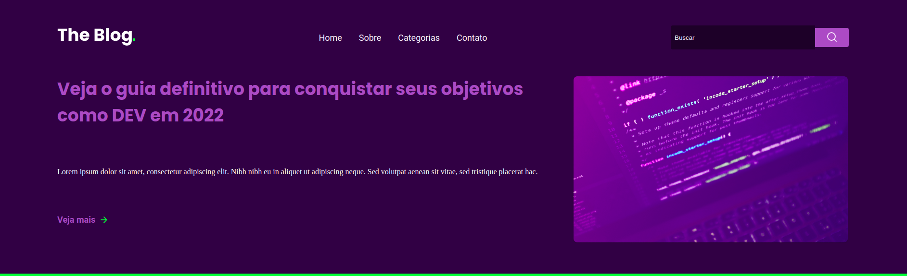

# Blog

## Technologies used

This project was done using the following technologies

 **HTML**

 **CSS**

## Objective of project

This project was intended to be an exercise in the basic knowledge that I had already acquired. However, it simulates a website, more specifically a blog. However, being a landing page it can have numerous functions, such as transmitting news, information and many other things. It can be used for commercial, business or personal use (blog).

## What I learned from this project

 

As I mentioned previously, this project was to exercise my knowledge that had been acquired previously. Exercising what you have learned is very important, but of course, by practicing you also learn many other things that only practice teaches.
